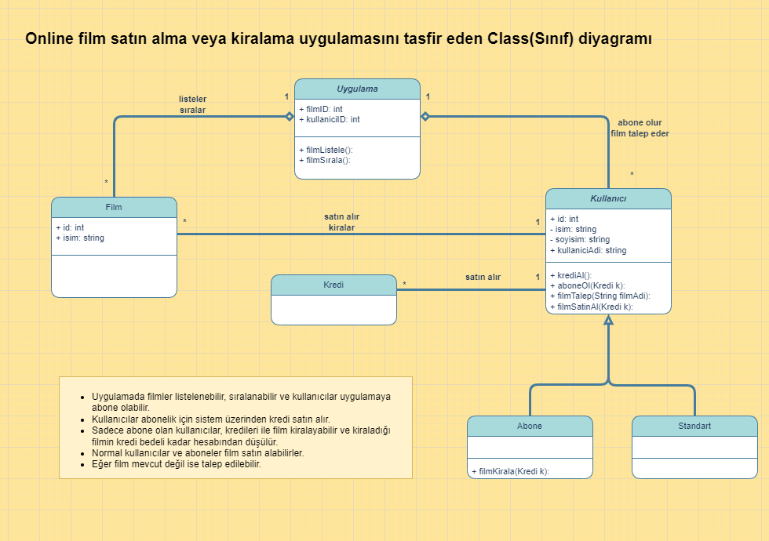

# Online_Film_Sistemi
Bu proje **PatikaAcademy.dev** platformunun **Başlangıç Seviyesi .Net Core Patikası** eğitimi kapsamında **Ödev - Online Film Sistemi** dersi için yapılmıştır. İçerisinde 1 README, 1 LICENSE ve 1 Ucus_Yonetim_Sistemi.png dosyası barındırır.

## The Goal of the Project
Online film satan veya kiralayan uygulamanın sistemini tasarlamak.

**Uygulamada**
* Filmler listelenebilir, sıralanabilir ve kullanıcılar uygulamaya abone olabilir.
* Kullanıcılar abonelik için sistem üzerinden kredi satın alır.
* Sadece abone olan kullanıcılar, kredileri ile film kiralayabilir ve kiraladığı filmin kredi bedeli kadar hesabından düşülür.
* Normal kullanıcılar ve aboneler film satın alabilirler.
* Eğer film mevcut değil ise talep edilebilir.

## LICENSE
[MIT](LICENSE)
